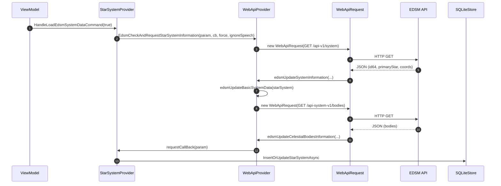

# Externe API-Integration

EDEA bezieht externe Daten von drei Quellen: **EDSM**, **Spansh** und **Canonn**. Die zentrale Steuerung erfolgt über den [`WebApiProvider`](../src/EDEA/Services/WebApiProvider.cs). Er verwaltet einen gemeinsamen `HttpClient`, regelt parallele Anfragen und wertet Antworten asynchron aus.

## Unterstützte Datenquellen

| Quelle | Verwendung | Basis-URL |
|--------|------------|-----------|
| EDSM | System-Informationen, Himmelskörper, Umgebungssysteme | `https://www.edsm.net` |
| Spansh | Systemnamen-Vorschläge, Galaxien- und Neutronen-Routen | `https://spansh.co.uk` |
| Canonn | Bio-Statistiken pro Genus | über [`WebApiProvider.CanonnRequestBioStatsAsync`](../src/EDEA/Services/WebApiProvider.cs) |

## Architektur

### `WebApiProvider`

Der [`WebApiProvider`](../src/EDEA/Services/WebApiProvider.cs) ist ein Singleton, das beim Start in [`App.xaml.cs`](../src/EDEA/App.xaml.cs) mit dem gemeinsamen `HttpClient` initialisiert wird.

- **Eigenschaften:**
  - `httpClient` – gemeinsam verwendeter `HttpClient`.
  - `isLoading` – globaler Ladezustand.
  - `AbsoluteRequestsInSession` – Anzahl aller Sitzungsanfragen.
  - `xRateRemaining` – verbleibendes Rate-Limit (Default 700).
  - `maxActiveRequests` – parallele Anfragenbegrenzung (17).
  - `requestWaitDelay` – Wartezeit bei Überlastung (700 ms).
  - `registeredRequestsCount` – aktuell registrierte Anfragen.

- **Wichtige Methoden:**
  - `SpanshRequestBasicSystemData(...)` – Systemnamen-Autovervollständigung.
  - `SpanshRequestGalaxyRouteCalculation(...)` – Spansh-Plotter-Route (POST).
  - `SpanshRequestNeutronRouteCalculation(...)` – Neutronen-Route (GET).
  - `EdsmCheckAndRequestStarSystemInformation(...)` – Systemdaten inkl. Himmelskörper.
  - `EdsmRequestSurroundingStarSystemsInformation(...)` – nächste Systeme in Kugel.
  - `CanonnRequestBioStatsAsync(...)` – Bio-Statistiken.

### `WebApiRequest`

Jede API-Anfrage wird als [`WebApiRequest`](../src/EDEA/Models/WebApiRequest.cs) instanziiert. Sie kapselt URL, [`WepApiQueryData`](../src/EDEA/Models/WepApiQueryData.cs), Callback und Ausgabe-Parameter.

- **Eigenschaften:** `Id` (GUID), `Parameter` (`WebApiParameter`).
- **Intern:** Sendet GET/POST, wertet `HttpStatusCode` aus und ruft den Callback mit `JsonNode` auf.

### `WepApiQueryData` und `WepApiQueryType`

- `GetQuery` – URL-Query-Parameter.
- `GetPath` – anzuhängender Pfad.
- `PostFormUrlEncodedContent` – Form-Body für Spansh-Routen.

### `WebApiParameter`

- [`WebApiParameter`](../src/EDEA/Models/WebApiParameter.cs) – Basisklasse mit `StatusCode`.
- [`WebApiParameterEdsmStarystem`](../src/EDEA/Models/WebApiParameterEdsmStarystem.cs) – EDSM-Systemanfrage.
- [`WebApiParameterEdsmSurroundings`](../src/EDEA/Models/WebApiParameterEdsmSurroundings.cs) – EDSM-Umgebung.
- [`WebApiParameterSpanshBasicSystemData`](../src/EDEA/Models/WebApiParameterSpanshBasicSystemData.cs) – Systemnamen.
- [`WebApiParameterSpanshGalaxyRoute`](../src/EDEA/Models/WebApiParameterSpanshGalaxyRoute.cs) – Routenergebnis mit `Jumps`.

## HTTP-Client und User-Agent

Der `HttpClient` wird in [`App.xaml.cs`](../src/EDEA/App.xaml.cs) als statisches Feld angelegt:

```csharp
private static readonly HttpClient httpClient = new();
```

Der User-Agent wird im Konstruktor gesetzt:

```csharp
httpClient.DefaultRequestHeaders.UserAgent.TryParseAdd(
    GetType().Assembly.GetName().Name + "/" + Globals.AppVersionString);
```

Dadurch sendet EDEA einen Header wie `EDEA/<Version>`.

## Rate-Limiting

EDEA verwendet mehrere Mechanismen, um externe APIs fair zu nutzen:

- **Parallele Anfragenbegrenzung:** `maxActiveRequests` ist auf 17 begrenzt. Liegen mehr Anfragen vor, wartet jede weitere 700 ms (`requestWaitDelay`).
- **X-Rate-Limit-Remaining:** Aus der Antwort wird der Header `X-Rate-Limit-Remaining` ausgelesen und in `xRateRemaining` gespeichert. Bei Werten unter 100 wird eine Warnung geloggt.
- **EDSM-Semaphor:** EDSM-Anfragen werden serialisiert (`edsmSemaphore`). Zwischen zwei nicht Folge-Anfragen wird mindestens eine Sekunde gewartet.

```csharp
// in WebApiRequest.initialize()
if (!_followUpRequest && _apiUrl.Contains("edsm.net", StringComparison.OrdinalIgnoreCase))
{
    await _webApiProvider.edsmSemaphore.WaitAsync().ConfigureAwait(false);
    var sinceLast = DateTime.UtcNow - _webApiProvider.lastEdsmRequest;
    if (sinceLast < TimeSpan.FromSeconds(1) && _webApiProvider.lastEdsmRequest != DateTime.MinValue)
    {
        await Task.Delay(TimeSpan.FromSeconds(1) - sinceLast).ConfigureAwait(false);
    }
    _webApiProvider.lastEdsmRequest = DateTime.UtcNow;
}
```

## Fehlerbehandlung

- **HTTP-Fehler:** Antwortcodes außer `OK` oder `Accepted` loggen einen Fehler und beenden die Anfrage.
- **JSON-Fehler:** Ausnahmen beim Parsen werden gefangen; der Completion-Callback wird trotzdem aufgerufen, damit der UI-Status nicht hängen bleibt.
- **Allgemeine Ausnahmen:** Jede unbehandelte Ausnahme in `WebApiRequest.initialize()` wird geloggt, der Callback aufgerufen und die Anfrage aus der Registrierung entfernt.
- **Laden-Tracking:** `EnterLoading`/`ExitLoading` sorgen für konsistente `isLoading`-Zustände.

## EDSM-Integration

EDSM wird für zwei Hauptfälle genutzt:

1. **Systemdaten:** `api-v1/system` mit `showPrimaryStar`, `showId`, `showCoordinates`, `showInformation`.
2. **Himmelskörper:** `api-system-v1/bodies`.
3. **Umgebung:** `api-v1/sphere-systems` mit aufsteigenden Radien (`SurroundingsRadius`), bis mindestens 26 Systeme gefunden werden.

Die Anfrage kaskadiert: Systemdaten zuerst, bei Erfolg automatisch Himmelskörper anfordern.

## Spansh-Integration

Spansh wird für asynchrone Routenberechnungen verwendet:

- **Galaxien-Route:** POST auf `/api/generic/route` mit Schiffs- und FSD-Parametern. Antwort `Accepted` liefert eine `job`-ID, die per Polling unter `/api/results/{jobId}` abgefragt wird.
- **Neutronen-Route:** GET auf `/api/route` mit `from`, `to`, `range`, `efficiency` und `supercharge_multiplier`.
- **Systemnamen:** GET auf `/api/systems/field_values/system_names`.

## Sequenzdiagramm

Das folgende Diagramm zeigt den typischen Ablauf für eine EDSM-Systemanfrage inkl. anschließender Himmelskörper-Anfrage.


