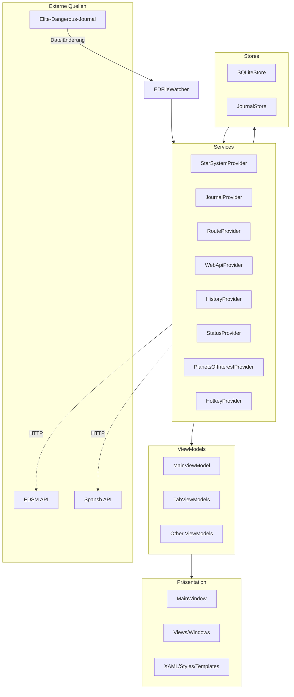
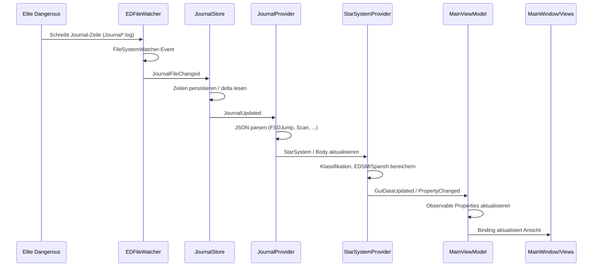

# EDEA-Architektur

Dieses Dokument beschreibt die Softwarearchitektur des **Elite Dangerous Exploration Assistent (EDEA)**: Designprinzipien, MVVM-Schichten, zentrale Komponenten und den Datenfluss von Spiel-Journal-Events bis zur Benutzeroberfläche.

## Ziele und Prinzipien

- **Wartbarkeit**: Klare Trennung von UI, UI-Logik, Geschäftslogik und Datenzugriff.
- **Echtzeitfähigkeit**: Journal-Dateien von *Elite Dangerous* werden überwacht und zeitnah verarbeitet.
- **Erweiterbarkeit**: Neue Datenquellen, Provider oder Views lassen sich in die vorhandene MVVM-Struktur einfügen.
- **Datenschutz**: Sensible Daten bleiben lokal; Web-API-Aufrufe sind zentral über `WebApiProvider` gesteuert.

## MVVM-Überblick

EDEA nutzt das Model-View-ViewModel-Muster mit dem **CommunityToolkit.Mvvm**-Toolkit:

- **Models** (`src/EDEA/Models/`): Datenklassen (z.B. `StarSystem`, `Planet`, `UserSettings`) und reine Wertobjekte.
- **Views** (`src/EDEA/Views/`): Wiederverwendbare XAML-Ansichten für Tabellen und Listen.
- **Windows** (`src/EDEA/Windows/`): WPF-Fenster wie `MainWindow`, `HudWindow` oder `PreferencesWindow`.
- **ViewModels** (`src/EDEA/ViewModels/`): Zustand und Befehle für Views, ableitend von `ViewModelBase` bzw. `ObservableObject`.
- **Commands** (`src/EDEA/Commands/`): `ICommand`-Implementierungen für Menüs und UI-Aktionen.
- **Converters** (`src/EDEA/Converters/`): WPF-Wertkonverter für Darstellungslogik.
- **Services** (`src/EDEA/Services/`): Singleton-Provider für Spiel-Daten, Einstellungen, Web-APIs und Hotkeys.
- **Stores** (`src/EDEA/Stores/`): SQLite-Datenzugriff mit Dapper (`SQLiteStore`) und Journal-Speicherung (`JournalStore`).

## Schichten

Von oben nach unten:

1. **Präsentation** – XAML-Windows, Views, Ressourcen und Styles.
2. **ViewModels** – CommunityToolkit.Mvvm, Commands, Observable Properties.
3. **Commands / Converters / Helpers** – UI-Interaktion, Wertumwandlung, Hilfsmethoden.
4. **Services** – Singleton-Provider für Geschäftslogik und externe APIs.
5. **Stores** – SQLite/Dapper-Datenbankzugriff und Journal-Speicherung.
6. **Externe Datenquellen** – Elite-Dangerous-Journal, EDSM, Spansh.

## Zentrale Komponenten

### Anwendungsebene

- `App` (`src/EDEA/App.xaml.cs`) – Singleton-Mutex, Log4Net-Konfiguration, Jot-Tracking, Startinitialisierung aller Services.
- `MainWindow` (`src/EDEA/MainWindow.xaml.cs`) – Hauptfenster mit benutzerdefinierter Titelleiste und Fenstersteuerung.
- `MainViewModel` (`src/EDEA/ViewModels/MainViewModel.cs`) – Koordination der Tabs, Commands, Hotkeys, HUD- und Einstellungsfenster.
- `Preferences` (`src/EDEA/Preferences.cs`) – Zentrale statische Einstellungs-API.
- `Globals` (`src/EDEA/Globals.cs`) – Konstanten, Übersetzungsmappings und Anwendungspfade.

### Datenzugriff

- `SQLiteStore` (`src/EDEA/Stores/SQLiteStore.cs`) – Persistenz für Sternensysteme, Körper, Ringe und Gattungen.
- `JournalStore` (`src/EDEA/Services/JournalStore.cs`) – Speicherung und Sequenzierung von Journal-Zeilen.
- `EDFileWatcher` (`src/EDEA/Services/EDFileWatcher.cs`) – `FileSystemWatcher` für Elite-Dangerous-Dateien (`Journal*.log`, `Status.json`, `NavRoute.json`).

### Provider-Services

- `StarSystemProvider` – Verwaltung des aktuellen Sternensystems.
- `JournalProvider` – Parsing aktueller Journal-Events.
- `RouteProvider` – Routenlogik und -zustand.
- `StatusProvider` – Verarbeitung der `Status.json`.
- `HistoryProvider` – Kommandantenhistorie.
- `PlanetsOfInterestProvider` – Filter und POI-Verwaltung.
- `WebApiProvider` – zentrale Koordination von EDSM- und Spansh-Aufrufen.
- `HotkeyProvider` – Registrierung und Auswertung globaler Hotkeys.
- `SpeechProvider` – Text-to-Speech-Ausgabe.

## Datenfluss: Journal → Provider → UI

Das folgende Diagramm zeigt den zentralen Echtzeit-Datenfluss:

## Erweiterbarkeit

- Neue Tab-Inhalte werden als `TabViewModel` in `MainViewModel` registriert.
- Neue externe Datenquellen implementieren einen Aufruf über `WebApiProvider` bzw. einen eigenen Service.
- Neue Journal-Events werden in `JournalProvider` erkannt und an `StarSystemProvider` oder `RouteProvider` weitergeleitet.

## Sicherheits- und Datenschutzaspekte

- Einstellungen und Logs werden unter `%LOCALAPPDATA%\EDEA` gespeichert, nicht im Installationsverzeichnis.
- HTTP-Aufrufe verwenden einen zentralen `HttpClient` mit projektspezifischem User-Agent.
- EDSM- und Spansh-Anfragen erfolgen ausschließlich über `WebApiProvider`; API-Parameter sind in `Models/WebApiParameter*.cs` typisiert.
