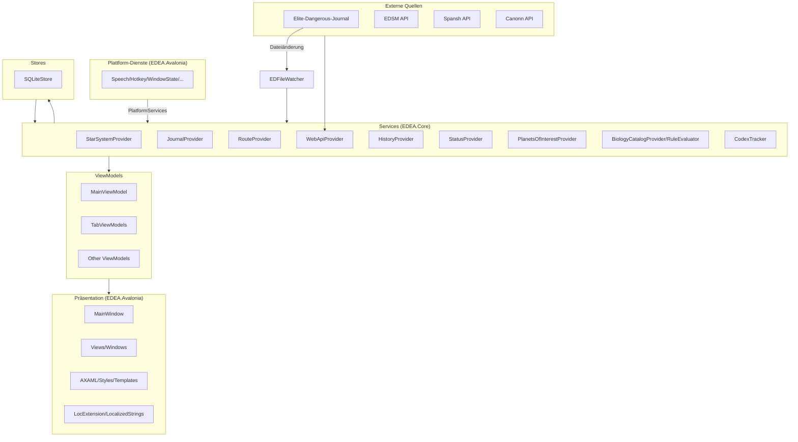

# EDEA-Architektur

Dieses Dokument beschreibt die Softwarearchitektur des **ED Exploration Assistant (EDEA)**: Designprinzipien, Schichten, zentrale Komponenten und den Datenfluss von Spiel-Journal-Events bis zur Benutzeroberfläche.

## Ziele und Prinzipien

- **Wartbarkeit**: Klare Trennung von UI, UI-Logik, Geschäftslogik und Datenzugriff.
- **Plattformunabhängigkeit des Kerns**: `EDEA.Core` enthält keine UI-Abhängigkeiten; plattformspezifische Dienste werden über Interfaces (`PlatformServices`) injiziert.
- **Echtzeitfähigkeit**: Journal-Dateien von *Elite Dangerous* werden überwacht und zeitnah verarbeitet.
- **Erweiterbarkeit**: Neue Datenquellen, Provider oder Views lassen sich in die vorhandene MVVM-Struktur einfügen.
- **Datenschutz**: Sensible Daten bleiben lokal; Web-API-Aufrufe sind zentral über `WebApiProvider` gesteuert.

## Projektstruktur

| Projekt | Zweck |
|---------|-------|
| `src/EDEA.Core` | Plattformunabhängige Kernbibliothek: Modelle, ViewModels, Services, Stores, Ressourcen (lokalisiert, en/de/ru). |
| `src/EDEA.Avalonia` | Avalonia-UI-Anwendung: Fenster, Views, Plattform-Service-Implementierungen, Localization-Markup. |
| `test/EDEA.Tests` | Unit-Tests (xUnit). |

## MVVM-Überblick

EDEA nutzt das Model-View-ViewModel-Muster mit dem **CommunityToolkit.Mvvm**-Toolkit:

- **Models** (`src/EDEA.Core/Models/`): Datenklassen (z. B. `StarSystem`, `Planet`, `UserSettings`), Biologie-Modelle (`Models/Biology/`), Speech-Output-Objekte und reine Wertobjekte.
- **ViewModels** (`src/EDEA.Core/ViewModels/` + `src/EDEA.Avalonia/ViewModels/`): Zustand und Befehle für Views, ableitend von `ViewModelBase` bzw. `ObservableObject`.
- **Views** (`src/EDEA.Avalonia/Views/`): Wiederverwendbare AXAML-Ansichten für Tabellen und Tooltips.
- **Windows** (`src/EDEA.Avalonia/Windows/`): Fenster wie `MainWindow`, `HudWindow` oder `PreferencesWindow`.
- **Converters/Behaviors** (`src/EDEA.Avalonia/Converters/`, `Helpers/`): Wertkonverter und Attached Behaviors für Darstellungslogik.
- **Services** (`src/EDEA.Core/Services/`): Singleton-Provider für Spiel-Daten, Einstellungen, Web-APIs und Biologie.
- **Service-Abstraktionen** (`src/EDEA.Core/Services/Abstractions/`): Interfaces für Plattformdienste (Speech, Hotkeys, Dialoge, Fensterzustand u. a.), implementiert in `src/EDEA.Avalonia/Services/` und über `PlatformServices` registriert.
- **Stores** (`src/EDEA.Core/Stores/`): SQLite-Datenzugriff mit `Microsoft.Data.Sqlite` + Dapper (`SQLiteStore`).

## Datenfluss (Journal → UI)

1. `EDFileWatcher` erkennt Änderungen an Journal/NavRoute/Status im Saved-Games-Ordner.
2. `JournalStore` liest neue Journal-Zeilen inkrementell.
3. `JournalProvider` parst die Zeilen und aktualisiert `StarSystem`/`Body` (inkl. Biologie-relevanter Scan-Felder).
4. `StarSystemProvider` aggregiert Zustand (aktuelles System, Route, Umgebung, Aktivität) und feuert UI-Events.
5. `BiologyCatalogProvider` + `BiologyRuleEvaluator` berechnen Arten-Vorhersagen; `CodexTracker` markiert Erstentdeckungen.
6. `HistoryProvider` persistiert besuchte Systeme über `SQLiteStore`.
7. ViewModels beobachten die Provider-Events und aktualisieren gebundene Eigenschaften.

## Lokalisierung

- Ressourcen in `src/EDEA.Core/Properties/Resources.{resx,de.resx,ru.resx}`.
- `Resources.Culture` + `CultureChanged`-Event steuern die Sprache live.
- AXAML nutzt `{l:Loc Key}` (`EDEA.Avalonia/Localization/`), das bei Kulturwechsel über den `Item[]`-Indexer invalidiert wird.
- Sprachphrasen-Defaults folgen der UI-Sprache (`SettingsProvider.MigrateSpeechDefaults`).

## Persistenz

- `settings.json`, `windowstate.json` und `db/EDEA.db` liegen unter `%LOCALAPPDATA%\EDEA.Core`.
- Datenbanktabellen: `StarSystems`, `Bodies`, `Rings`, `Genera`, `CodexScans`, `ImportedJournalFiles` – siehe [`DATABASE.md`](./DATABASE.md).

## Threading

- Journal-/Datei-Verarbeitung läuft im Hintergrund; UI-Aktualisierungen werden über `IDispatcher` auf den UI-Thread gemarshallt.
- `WebApiProvider` drosselt parallele Requests (`maxActiveRequests`, Rate-Limit-Beachtung).
