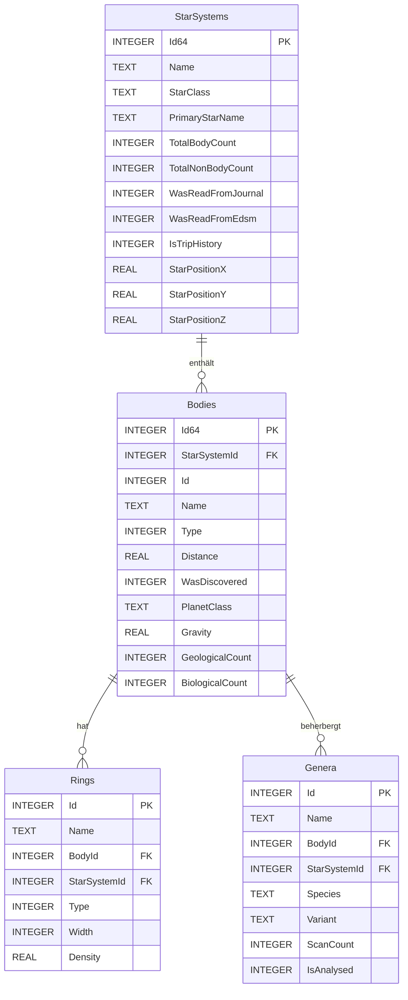

# Datenbank und Persistenz

EDEA nutzt **SQLite** als lokale Datenbank in Kombination mit **Dapper** für Objekt-Mapping. Himmelskörper, Ringe, Genus-Daten und Sternensysteme werden in einer einzelnen SQLite-Datei im Anwendungsdaten-Ordner gehalten. Journal-Dateien werden hingegen zeilenweise aus dem Elite-Dangerous-Saved-Games-Ordner eingelesen und nicht in die Datenbank geschrieben.

## Übersicht

| Komponente | Technologie | Zweck |
|------------|-------------|-------|
| Datenbank | SQLite (`Microsoft.Data.Sqlite`) | Persistente Sternensystem-Historie, Körper, Ringe, Genus-Daten. |
| ORM/Micro-Mapper | Dapper | `Query<T>`, `Execute`, `ExecuteScalar` gegen SQLite-Verbindungen. |
| Zentraler Store | [`SQLiteStore`](../src/EDEA/Stores/SQLiteStore.cs) | CRUD-Operationen und Schema-Initialisierung. |
| Journal-Speicher | [`JournalStore`](../src/EDEA/Services/JournalStore.cs) | Dateibasiertes Lesen der aktuellen `Journal*.log`. |

## SQLiteStore

[`SQLiteStore`](../src/EDEA/Stores/SQLiteStore.cs) ist ein Singleton, das beim ersten Aufruf von `Instance(string? dbPath = null)` erzeugt wird. Standardmäßig liegt die Datenbank unter `%LOCALAPPDATA%\EDEA\edea.sqlite`.

- **Verbindung:** `Connect()` erzeugt eine neue `SqliteConnection` anhand des Connection-Strings.
- **Initialisierung:** `EnsureSchema()` erstellt die Tabellen `StarSystems`, `Bodies`, `Rings` und `Genera` per `CREATE TABLE IF NOT EXISTS`.
- **Event:** `DatabaseStarSystemTableUpdated` wird nach schreibenden Operationen ausgelöst.

### Wichtige Methoden

| Methode | Zweck |
|---------|-------|
| `GetOrCreateStarSystem(...)` | Liest ein System oder legt es neu an. |
| `ReadStarSystem(...)` | Liest ein System inklusive aller Körper, Ringe und Genus-Daten. |
| `ReadAllStarSystemBasicData()` | Liest Id, Name und Trip-History-Flag aller Systeme. |
| `InsertOrUpdateStarSystemAsync(...)` | Upsert eines kompletten Systems mit allen Körpern, Ringen und Genus-Daten. |
| `UpsertBody(...)` | Schreibt oder aktualisiert einen einzelnen Körper. |
| `UpsertGenus(...)` | Schreibt oder aktualisiert einen Genus-Eintrag. |
| `SaveRingsForBody(...)` | Ersetzt die Ringe eines Körpers. |
| `ClearAllStarSystems()` | Leert alle vier Tabellen. |
| `ResetTripHistory()` | Setzt `IsTripHistory` für alle Systeme zurück. |
| `ResetIncompleteAnalysisForGenera()` | Setzt unvollständige Genus-Scans zurück. |

## Dapper-Nutzung

Dapper wird direkt auf `IDbConnection` aufgerufen. Beispiele:

```csharp
using var db = Connect();
db.Open();
var starSystems = db.Query<StarSystem>(
    "SELECT Id64 AS Id, Name, IsTripHistory FROM StarSystems").ToList();
```

- **Typ-Mapping:** Klassen wie `StarSystem`, `Body`, `Planet` und `Star` haben Konstruktoren, die direkt aus Dapper-Zeilenmaterialisiert werden können.
- **Polymorphe Körper:** `ReadStarSystem` verwendet `GetRowParser<Body>`, `GetRowParser<Planet>` und `GetRowParser<Star>` und entscheidet anhand der `Type`-Spalte (`BodyType`), welche Klasse instanziiert wird.
- **UPSERTs:** Alle Schreiboperationen nutzen `INSERT ... ON CONFLICT(...) DO UPDATE SET`, um Idempotenz zu gewährleisten.

## SQLite-Schema

### `StarSystems`

| Spalte | Typ | Beschreibung |
|--------|-----|--------------|
| `Id64` | INTEGER | Primärschlüssel (Id64 des Systems). |
| `Name` | TEXT | Name des Systems. |
| `StarClass` | TEXT | Klasse des Primärsterns. |
| `PrimaryStarName` | TEXT | Name des Primärsterns. |
| `TotalBodyCount` | INTEGER | Anzahl bekannter Körper. |
| `TotalNonBodyCount` | INTEGER | Anzahl Nicht-Körper. |
| `WasReadFromJournal` | INTEGER | Aus Journal gelesen. |
| `WasReadFromEdsm` | INTEGER | Aus EDSM gelesen. |
| `WasRequestedFromEdsm` | INTEGER | EDSM wurde angefragt. |
| `EdsmName`, `EdsmPrimaryStarType`, `EdsmPrimaryStarName`, `EdsmPrimaryStarIsScoopable`, `EdsmTotalBodyCount` | – | EDSM-spezifische Felder. |
| `StarPositionX`, `StarPositionY`, `StarPositionZ` | REAL | Koordinaten. |
| `IsTripHistory` | INTEGER | Gehört zur Reisehistorie. |
| `AllBodiesFound` | INTEGER | Alle Körper gefunden. |
| `Population` | INTEGER | Bevölkerung. |

### `Bodies`

Gemeinsame Tabelle für `Body`, `Planet` und `Star`. Der Wert der `Type`-Spalte entscheidet über die tatsächliche Modellklasse.

| Spalte | Typ | Beschreibung |
|--------|-----|--------------|
| `Id64` | INTEGER | Primärschlüssel (`StarSystemId * 1000 + Id`). |
| `StarSystemId` | INTEGER | Fremdschlüssel zu `StarSystems(Id64)`. |
| `Id` | INTEGER | Körper-Id innerhalb des Systems. |
| `Name` | TEXT | Körpername. |
| `Type` | INTEGER | `BodyType` (Unbekannt/Planet/Stern). |
| `Distance` | REAL | Distanz vom Ankunftspunkt in Ls. |
| `WasDiscovered`, `WasMapped`, `WasFootfalled` | INTEGER | Entdeckungs- und Scan-Status. |
| `PlanetClass`, `IsLandable`, `TerraformingState`, `SurfaceScanned`, `Gravity`, `GeologicalCount`, `BiologicalCount` | – | Planet-spezifische Felder. |
| `StarType` | TEXT | Sternentyp. |
| `Radius`, `Mass`, `OrbitalInclination` | REAL | Physikalische Werte. |
| `CartographicValue` (und weitere `Cartographic*`) | INTEGER | Kartographische Wertberechnung. |
| `RingsReserveLevel`, `HasBiological`, `HasGeological`, `IsValuable`, `IsTerraformable` | INTEGER | Flags und Zustände. |

### `Rings`

| Spalte | Typ | Beschreibung |
|--------|-----|--------------|
| `Id` | INTEGER | Primärschlüssel (Autoincrement). |
| `Name` | TEXT | Ringname. |
| `BodyId` | INTEGER | Körper-Id. |
| `StarSystemId` | INTEGER | System-Id. |
| `Type`, `Mass`, `InnerRadius`, `OuterRadius`, `Width`, `Density` | – | Physikalische Ringdaten. |
| `UNIQUE(StarSystemId, BodyId, Name)` | – | Verhindert Duplikate. |

### `Genera`

| Spalte | Typ | Beschreibung |
|--------|-----|--------------|
| `Id` | INTEGER | Primärschlüssel (Autoincrement). |
| `Name` | TEXT | Genus-Name. |
| `BodyId` | INTEGER | Körper-Id. |
| `StarSystemId` | INTEGER | System-Id. |
| `Species`, `Variant` | TEXT | Art/Variante. |
| `ScanCount` | INTEGER | Anzahl Scans. |
| `IsAnalysed` | INTEGER | Vollständig analysiert. |
| `VistaGenomicsValue` (und `VistaGenomics*`) | REAL/INTEGER | Biologische Werte. |
| `LongitudeAt1stScan`, `LatitudeAt1stScan`, `LongitudeAt2ndScan`, `LatitudeAt2ndScan` | REAL | Scan-Standorte. |
| `IsFirstDiscovered`, `WasLogged` | INTEGER | Flags. |

## JournalStore

[`JournalStore`](../src/EDEA/Services/JournalStore.cs) speichert **keine** Journal-Zeilen in der SQLite-Datenbank, sondern liest die aktuelle Journal-Datei des Spiels:

- **Wegwerfspeicher:** `_journal` (Byte-Liste) und `_lastJournalAddition` für inkrementelle Änderungen.
- **Puffergröße:** `_readPufferSize = 1024`.
- **Pollen:** `_touchJournalFileTimer` mit 5.000 ms prüft Dateiänderungen.
- **Retry:** Bis zu 10 Leseversuche bei gesperrten Dateien, jeweils 500 ms Pause.
- **Event:** `JournalUpdated` liefert `sequelRead` (zusammenhängendes Weiterlesen) und die neuen Zeilen.

## Migrations- und Initialisierungskonventionen

- **Keine versionierten Migrationen:** `EnsureSchema()` erstellt alle Tabellen nur, falls sie noch nicht existieren (`CREATE TABLE IF NOT EXISTS`).
- **Lazy Initialisierung:** `_initialized` verhindert wiederholte Schema-Prüfungen.
- **Upsert statt Delete/Insert:** Alle Schreiboperationen verwenden SQLite-`ON CONFLICT`-Klauseln, um Daten zusammenzuführen.
- **Verzeichniserstellung:** `Directory.CreateDirectory(Path.GetDirectoryName(path)!)` stellt sicher, dass das AppData-Verzeichnis existiert.
- **Fehlerbehandlung:** Schreib- und Leseoperationen sind in `try/catch` eingebettet und loggen Fehler; der Store versucht stets fortzufahren.

## ER-Diagramm


